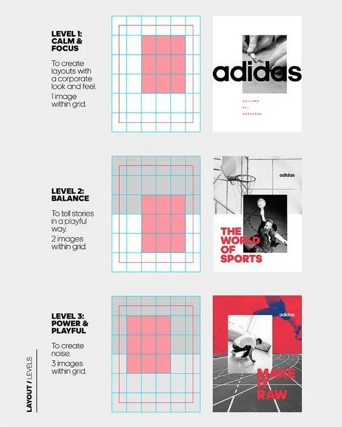
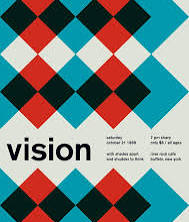
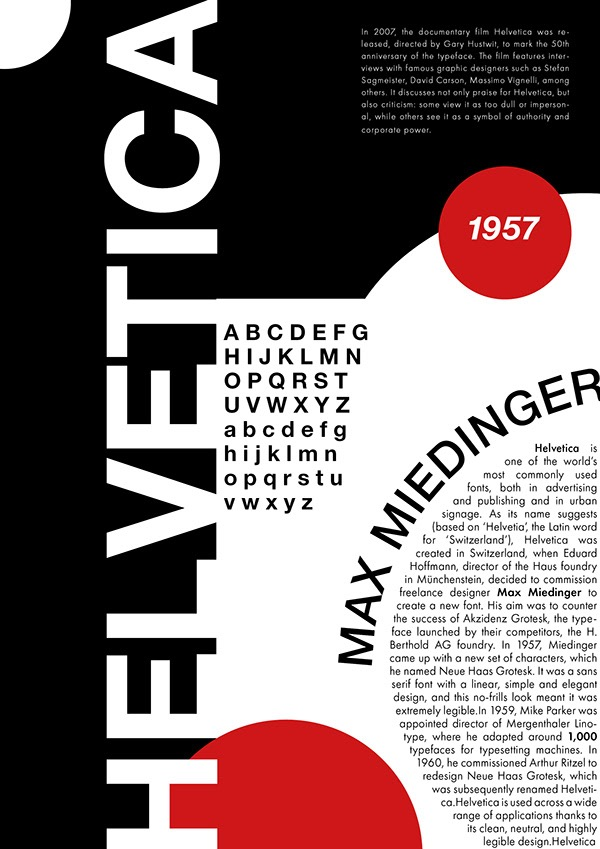
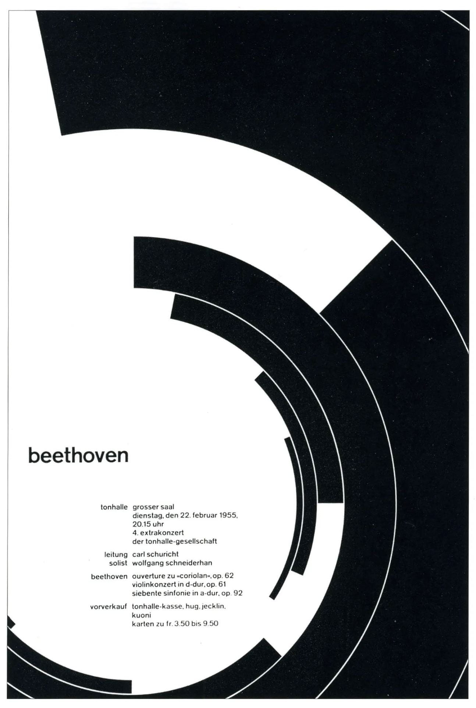
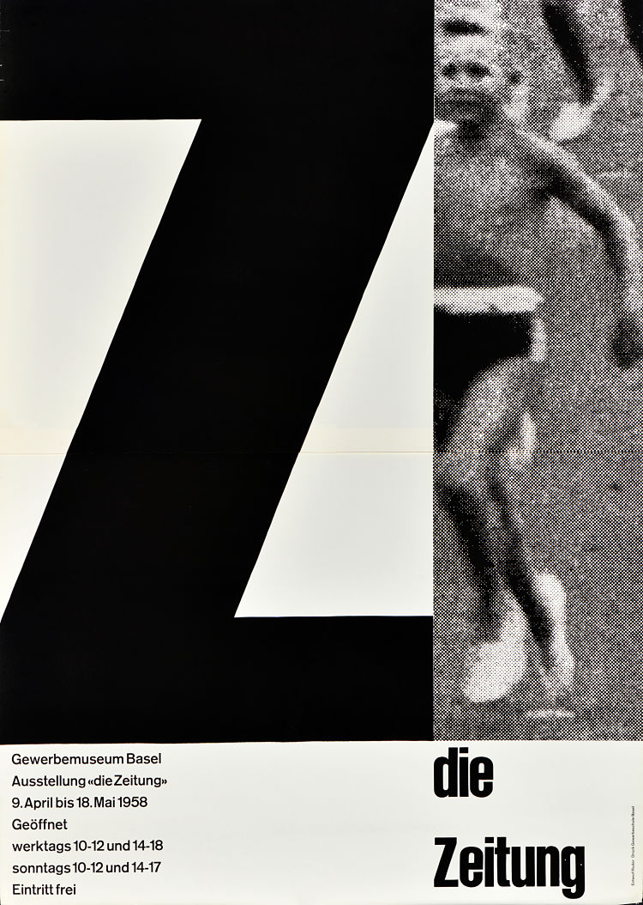
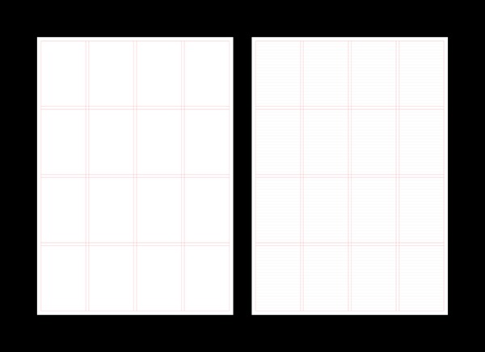
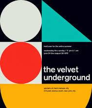
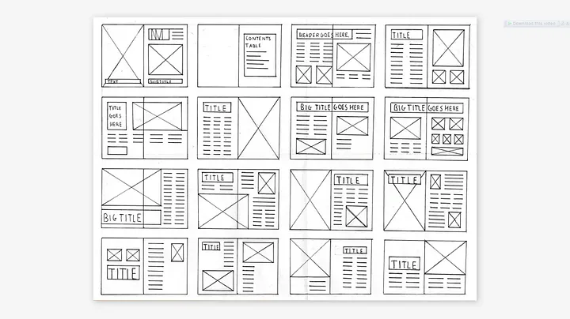
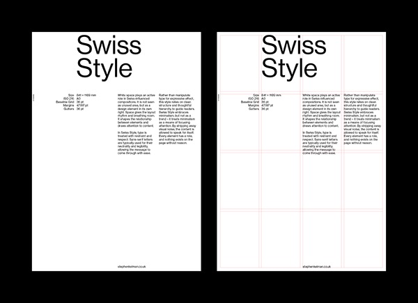

# Swiss Design (International Typographic Style) — Full Reference

This is the **depth layer**: the reasoning behind each of the nine tenets, the failure patterns each one exists to catch, and worked grid-construction examples. The **operational layer** — the making workflow, the review protocol, and the nine-check approval gate — lives in the parent `SKILL.md`; nothing there is repeated here in full. Open this file when you need the *why*: teaching the system, justifying a review verdict someone disputes, or resolving a hard trade-off between tenets.

**Historical spine (one paragraph, for context):** the style crystallizes in 1950s Switzerland — Josef Müller-Brockmann (Zurich, *Grid Systems in Graphic Design*), Emil Ruder and Armin Hofmann (Basel), Max Bill, and the typefaces Akzidenz-Grotesk, Univers (Frutiger, 1957), and Helvetica (Miedinger, 1957). Its bet: design is objective communication, so the designer's ego yields to a reproducible system. That bet is why the tenets below are *checkable* — they were designed to be teachable rules, not taste.

-----

## 1. Grid Systems

**Why it's first.** The grid is the only tenet that is a *decision* rather than a judgment. Once columns, gutters, margins, and baseline exist as numbers, most later questions ("where does this go?", "how big is this gap?") stop being matters of taste and become derivations. That is the whole Swiss move: convert taste into arithmetic wherever possible, and spend the remaining taste where arithmetic can't reach (ranking the content, choosing the one grid-break).

A grid is also a *reader's* tool, not just a maker's: consistent placement lets the eye predict where the next unit of information will appear, which is why gridded complexity feels effortless and ungridded simplicity still feels noisy.

**Failure patterns this tenet catches**

- *Grid-after-the-fact:* elements placed by eye, then a grid drawn to rationalize them. Tell: gutters of slightly different widths, margins that vary per side without intent.
- *Grid as cage:* every cell filled because it exists. Empty modules are part of the composition; a grid you never leave partially empty produces the dreaded "brochure" texture.
- *Unmotivated grid-break:* one element off-grid "for energy." A break works only when everything else is rigorously on-grid — one break is an accent, two is noise.

**Ask:** What invisible structure governs this layout? Could another designer read the system instantly?

## 2. Alignment

**Why it's separate from the grid.** A grid can exist and still be ignored — alignment is the *discipline of adherence*. Elements relate to each other by sharing edges and axes; every shared edge is one less decision the viewer's eye has to make. Swiss work is overwhelmingly flush-left / ragged-right because a hard left edge gives every line of type a common axis to hang from, while the rag keeps word-spacing even (justified type buys a hard right edge at the cost of rivers — usually a bad trade at display sizes).

**Failure patterns**

- *Optical center-ish:* elements "roughly" centered or "roughly" aligned. Near-alignment reads as error; exact alignment or deliberate offset, nothing between.
- *Axis proliferation:* every new element introduces its own left edge. Count the distinct axes — each one should be a column boundary, and there should be few.
- *Ignoring optical alignment:* geometric alignment isn't always optical alignment. Large punctuation, rounded letterforms, and images with internal whitespace may need to hang slightly past the margin to *look* aligned. The rule serves the eye, not the ruler.

**Ask:** What line is this element aligned to? Does every object belong somewhere?

## 3. Hierarchy

**Why it's the point of the whole system.** A layout is an argument about what matters. If the viewer can't reconstruct your ranking — first, second, third — in about three seconds, the layout has failed *as communication* regardless of how clean it looks. Swiss hierarchy is built with exactly five tools — **scale, weight, position, contrast, spacing** — and pointedly *not* with color-as-decoration, boxes, or effects, because those tools add elements while the real five only arrange what's already there.

The deep rule: **one dominant message**. Two "most important" elements means zero; dominance is exclusive by definition. Everything that is not the dominant or the supporting message is secondary and should look interchangeable with its peers.

**Failure patterns**

- *Escalation:* fixing weak hierarchy by making the top thing bigger, then the next thing bigger to compensate. Demote instead — hierarchy is made by lowering the floor more often than raising the ceiling.
- *Hierarchy by decoration:* the important thing is boxed, colored, and starred instead of being big and well-placed. Strip the decoration and the ranking vanishes — which means there was no typographic hierarchy at all.
- *Even gray:* everything set at similar size and weight "for elegance." Elegant, and unreadable as an argument.

**Ask:** Can someone grasp this in three seconds? Can *you* write the read order without hesitating?

## 4. Typography First

**Why type, specifically.** Type is the only design material that carries the message *literally* — everything else (image, color, shape) carries it by association. Swiss design therefore tests every layout against a brutal counterfactual: *would this still work if every image disappeared?* If yes, imagery is a reinforcement, which is strength. If no, the composition is leaning on decoration to do type's job.

The sans-serif preference isn't fashion: grotesques (Akzidenz, Helvetica, Univers) have even stroke weight and closed, neutral forms, so they build *texture* — uniform gray blocks whose hierarchy comes entirely from size, weight, and space. A face with strong personality spends the viewer's attention on itself.

**Failure patterns**

- *Effect creep:* shadows, outlines, gradients, letter-spaced lowercase. Every effect is an admission that scale, weight, and position weren't tried hard enough.
- *Face inflation:* a third typeface "just for the numbers." Two faces (one working sans + optionally one mono or serif for a defined role) cover every legitimate need.
- *Adjacent weights:* Medium next to Semibold reads as a printing error. Jump full steps — Regular to Bold — so the difference is a signal, not a smudge.

**Ask:** Would this still work if every image disappeared?

## 5. Asymmetrical Balance

**Why not just center everything.** Symmetry is balance you get for free, and it reads that way — static, ceremonial, default. Asymmetry forces an actual compositional decision: mass on one side must be countered by *something* on the other, and in Swiss work that something is usually **whitespace with a small anchor** (a caption, a logo, a date). This produces tension-with-stability — the layout feels alive but not precarious.

Mechanically: visual weight ≈ size × darkness × complexity. A huge light-gray numeral can be countered by a small black word; a photograph (high complexity) outweighs a same-sized flat color block. Balance these *across the grid's columns*, not freehand.

**Failure patterns**

- *Reflexive centering:* centered because no one decided otherwise. Centering is permitted — as an argued choice (formal invitations, single-word statements) — never as a default.
- *Symmetric asymmetry:* mass on the left countered by equal mass on the right. That's symmetry wearing a costume; the counterweight should usually be smaller plus more space.
- *Fear of the void:* the empty half of an asymmetric layout gets "just a little something." The void *is* the counterweight; filling it un-balances the composition.

**Ask:** Does the composition feel intentional rather than mirrored?

## 6. Contrast

**Why steps must be big.** Contrast is the *mechanism* of hierarchy (tenet 3 is the goal; this is the physics). Human size discrimination at a glance is coarse: a 1.1–1.3× size difference reads as "same, but sloppy," not "different." Swiss practice therefore steps in large ratios — 1.5×, 2×, 3× and beyond between hierarchy levels — and the classic posters run display type at 5–10× body size. The rule of thumb: **if you have to look twice to see the difference, it isn't contrast, it's inconsistency.**

Contrast is spent on one axis at a time: if two levels already differ 2× in size, they don't also need a weight change *and* a color change — stacking every difference on every boundary flattens the system back into noise.

**Failure patterns**

- *Timid ramps:* 14 / 16 / 18 / 21 type ladders. Merge to two or three sizes with real jumps.
- *Everything loud:* all-bold, all-large. Contrast is relative; a page of shouting has no emphasis anywhere.
- *Contrast without ranking:* big differences between elements of equal importance — decorative contrast that lies about the hierarchy.

**Ask:** What is the single most important thing on the page — and does the size arithmetic agree?

## 7. White Space

**Why it's "active."** Space is doing one of three jobs or it's wasted: **separating** (unrelated things far apart), **grouping** (related things close — proximity is the strongest grouping cue there is, stronger than boxes or rules), or **staging** (a void that gives the dominant element room to dominate). Because proximity encodes relationships, spacing is *information* — which is why the gate insists related items sit measurably closer to each other than to unrelated ones.

Perceived quality tracks whitespace almost linearly: generous margins are the cheapest luxury signal in design. And they are load-bearing — the margin is the frame that makes the grid legible. That's why the rule is absolute: when content doesn't fit, remove or shrink *content*; the margin is never the budget you raid.

**Failure patterns**

- *Fill-the-vacuum:* every gap treated as an invitation. Space that "does nothing" next to the dominant element is doing the most important job on the page.
- *Even spacing everywhere:* identical gaps between everything, so proximity encodes nothing. The between-group gap must be visibly larger (≥ 2×) than the within-group gap.
- *Boxes instead of space:* borders and background panels drawn to create grouping that spacing should have created for free.

**Ask:** What can be removed? What can be separated further?

## 8. Consistency

**Why systems create trust.** A viewer learns a layout's rules in the first two seconds — this size means heading, this gap means new section — and then applies them for free everywhere else. Every inconsistency forces a re-learn, and enough of them make the viewer distrust the *content* ("if they were careless here…"). Consistency is also what makes a one-page design extensible into a system: the second poster, the fifth slide, the fiftieth screen.

The mechanical form of consistency is the **token**: one ladder of sizes, one ladder of spacing values (all baseline multiples), one rule per role. If a value isn't on a ladder, it's a bug.

**Failure patterns**

- *Near-duplicates:* 24px here, 26px there, for elements playing the same role. Pick one.
- *Special-casing the boss's slide:* one instance styled differently "because it matters more." Importance is expressed *within* the system (scale, position), never by leaving it.
- *Consistency without a system:* copying values around by hand. Name the tokens; consistency you can't state is consistency you'll lose.

**Ask:** If this element changes, should every similar element change too?

## 9. Restraint

**Why it's last and hardest.** Every other tenet tells you how to arrange what's there; restraint asks whether it should be there at all. It is the most overlooked principle because addition always has an advocate (someone asked for the badge, the tagline, the second logo) and subtraction has none — so the designer must be subtraction's advocate. The test is falsifiable: **name what breaks if this element is removed.** If nothing breaks, it was decoration; if you can't decide, remove it and look — the redesign is free, the clutter isn't.

Restraint applies to the system too, not just the elements: fewer type sizes, fewer spacing values, fewer colors, fewer rules. The strongest Swiss work reads as *one idea executed completely* — one grid, one type family, one accent, one break.

**Failure patterns**

- *Redundant encoding:* an icon next to a word that says the same thing; a heading restating the paragraph's first line; a rule under a heading that scale already separated.
- *Ornamental structure:* boxes, rules, and background tints doing no informational work — the grid and the whitespace already did it.
- *Feature-creep survival:* elements kept because they were once requested, long after their reason died. Every element must re-justify itself in *this* layout.

**Ask:** Does this element improve communication? If removed, does the design get stronger?

-----

## Worked grid constructions

Deriving the numbers, end to end. (Defaults and quick specs live in `SKILL.md`; these show the method so you can rebuild them for any frame.)

### A. Web page, 1200px container

1. Baseline unit `--u = 8px`. Body type 16px with 24px line-height (3u).
2. Margins: side padding 96px (12u) — comfortably ≥ 3× the gutter.
3. Columns: 12, gutter 24px (3u). Column width is then `(1200 − 2×96 − 11×24) / 12 = 62px` — you never place *to* that number; CSS derives it: `grid-template-columns: repeat(12, 1fr); gap: 24px;`.
4. Spacing ladder: 8 / 16 / 24 / 32 / 48 / 64 / 96 — nothing off-ladder.
5. Type ladder with real jumps: 13 (meta) → 16 (body) → 32 (subhead, 2×) → 96 (display, 3×). Line-heights 16 / 24 / 40 / 96 — all baseline multiples.

### B. A2 poster, 420 × 594mm (Müller-Brockmann modular method)

1. Body text: 9pt / 12pt leading → the baseline unit is **12pt ≈ 4.2mm**.
2. Margins: 20mm left/right/top, 30mm bottom (the larger bottom margin keeps the field from sagging optically).
3. Live area: 380 × 544mm. Choose 4 columns; gutter = one line of leading ≈ 4.2mm → column width `(380 − 3×4.2) / 4 ≈ 91.8mm`.
4. Rows: 544mm ≈ 129 baselines. Choose 6 row-modules of 21 baselines each with 1 blank baseline between (6×21 + 5×1 = 131 ≈ close; absorb the 2-line remainder into the bottom margin). Each module is a placement cell; elements span whole modules.
5. Display type: pick from the poster's own arithmetic — e.g. headline cap-height = 2 modules tall. The type sizes come *from the grid*, which is why the result coheres.

### C. Social crop, 1080 × 1350 (4:5)

1. Baseline 8px; margins 72px; live area 936 × 1206.
2. 4 columns, gutter 24px → columns of `(936 − 3×24) / 4 = 216px`.
3. Type floors for feed legibility: body ≥ 32px, display ≥ 120px. Fewer elements than you think — a social crop holds one dominant message, one line of support, one mark. If the brief supplies more, that's a restraint conversation, not a smaller font.

-----

## Trade-offs between tenets (how to resolve conflicts)

- **Hierarchy vs. consistency:** consistency governs elements of the *same role*; hierarchy differentiates *roles*. If you're breaking consistency to make something important, first ask whether it's actually a different role — if yes, give the role its own token; if no, don't break.
- **Whitespace vs. density (dense tables, legal text):** density wins on information, whitespace wins on structure. Keep the information, spend the whitespace at the *boundaries* — margins, between-group gaps — rather than inside the dense block. The operational playbook is in `SKILL.md` ("When content resists reduction").
- **Asymmetry vs. the grid:** asymmetry happens *on* the grid (unequal column spans), never by leaving it.
- **Restraint vs. the brief:** when the client insists on the seventh element, don't distribute the pain evenly — protect the dominant message absolutely and let the secondary tier absorb the crowding.

For the approval gate itself — the nine pass/fail checks with failure actions — use `SKILL.md`; this file is the argument, that one is the verdict.
